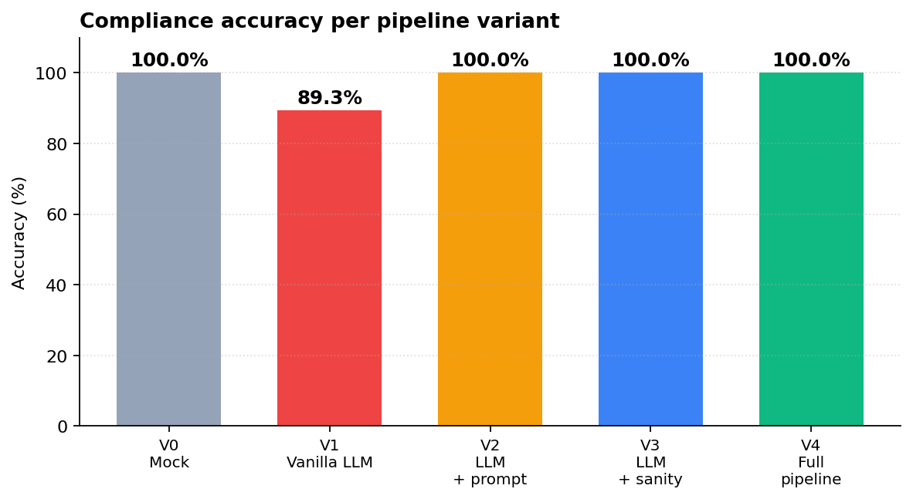
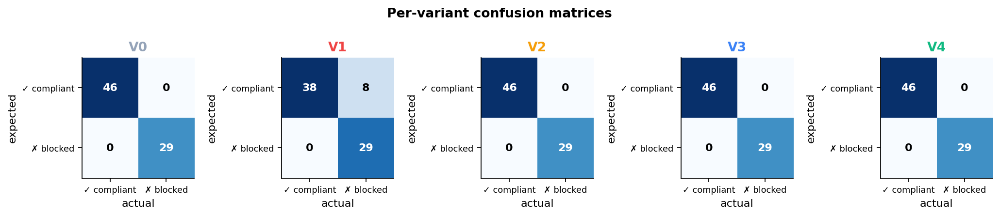
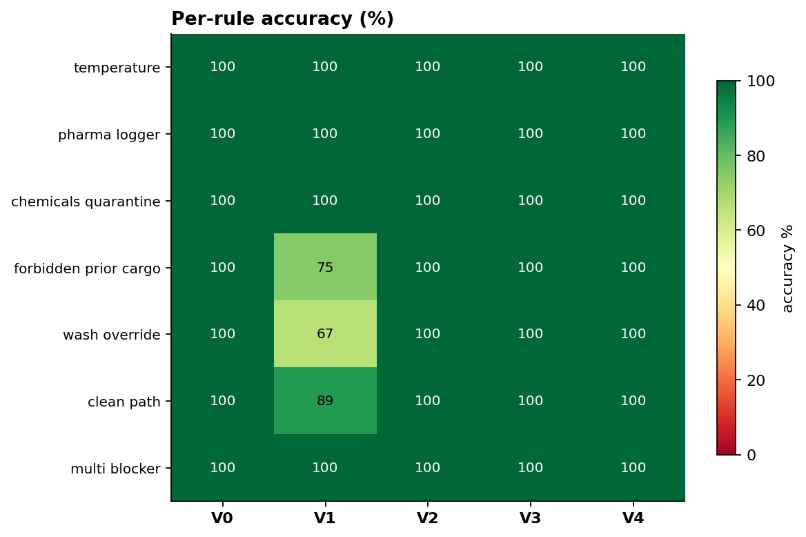
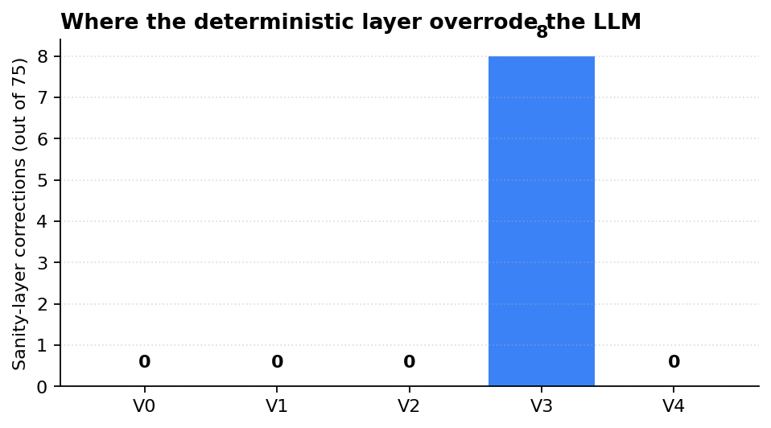
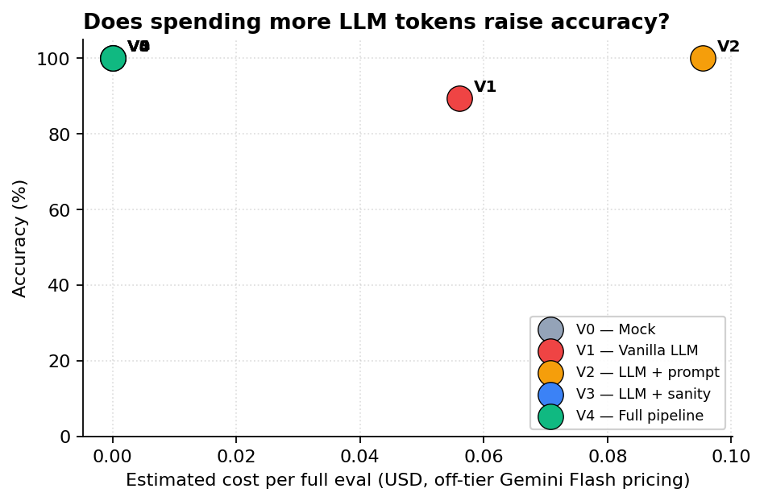
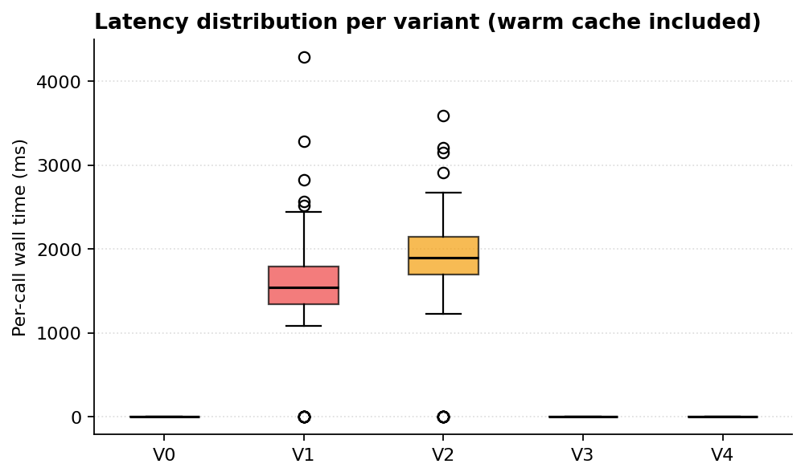

# Evaluation — Empty-Backhaul Compliance Analyst

This document is the experimental chapter of the thesis: hypothesis, method,
results, and discussion of an ablation study comparing five variants of the
multi-agent compliance pipeline.

> **Headline result.** A vanilla LLM (Gemini 2.5 Flash with a minimal
> system prompt) achieves **89.3% accuracy** on a 75-case ground-truth set
> of Romanian cold-chain backhaul matches. **Either** disciplined prompt
> hardening **or** a deterministic post-LLM sanity layer raises that to
> **100%**, with the sanity layer triggering on exactly the 8 cases the
> vanilla LLM gets wrong. The full pipeline keeps both as defence in depth.

---

## 1. Hypothesis

> **H₁.** Free-form LLM reasoning over deterministic compliance rules is
> measurably less reliable than a hybrid pipeline that re-validates the
> LLM's verdicts against the same rules expressed as code.

The Analyst node is a natural test bed: every rule it enforces (temperature
band match, pharma logger requirement, ANSVSA wash override, EU 561/2006
driving hours) is expressible as a pure predicate over the truck/load pair.
A correctly-built deterministic checker therefore *defines* ground truth for
those rules, so any LLM disagreement is by definition a model error — not a
matter of judgement.

We expect the LLM to:

- **succeed** on rules with clean numeric thresholds (capability matching,
  pharma logger boolean, chemicals quarantine — single-clause checks);
- **struggle** on the two rules that require correctly reading the
  *direction* of a relationship in the prompt (forbidden_prior_cargo:
  the load forbids the truck's prior, NOT vice versa) or chaining a
  three-condition predicate (ANSVSA wash override: valid + matching prior
  + override-eligible cargo).

---

## 2. Method

### 2.1 Pipeline variants

| ID | Variant | System prompt | Sanity layer |
|----|---------|---------------|--------------|
| V0 | Mock-only | — | — (deterministic predicates **are** the verdict) |
| V1 | Vanilla LLM | Minimal pre-PR2 prompt (~30 lines, schema only) | off |
| V2 | LLM + prompt hardening | Hardened prompt with explicit hard-rule sections + 3 worked examples for the failure modes | off |
| V3 | LLM + sanity layer | Minimal pre-PR2 prompt | on (post-LLM hard-rule re-check overrides `is_compliant`/`blockers` on disagreement) |
| V4 | Full pipeline | Hardened prompt | on |

V0 is a baseline by construction at 100% — it answers "if a deterministic
checker is the source of truth, what's the upper bound on accuracy?" V4 is
the system as actually shipped.

### 2.2 Dataset

`backend/tests/ground_truth.yaml` — 75 hand-labelled cases against the
seeded fixture pool of 10 trucks × 20 loads (200 total truck/load pairs;
75 selected to give per-rule coverage targets):

| Rule category | # rows | What it probes |
|---|---|---|
| temperature | 12 | Capability matching across all 5 cargo bands and all 5 truck capabilities, including the often-missed "frozen capability covers ambient" superset case |
| pharma_logger | 6 | Pharma load + logger required, with both pharma_2_8 and non-pharma trucks |
| chemicals_quarantine | 6 | Chemicals → food-grade blocked across cargo types; chemicals → chemicals OK |
| forbidden_prior_cargo | 12 | Direction-disambiguation cases — when the load's `forbidden_prior_cargo` includes the truck's `last_cargo` and when it doesn't |
| wash_override | 9 | Truck holds a valid ANSVSA wash certificate; tests both override-eligible cargoes (dairy, produce, ambient_dry) and ineligible (pharma) |
| clean_path | 18 | "Should be obviously compliant" — clean priors, capability matches, no forbidden lists |
| multi_blocker | 12 | Combinations: two or three rules fire simultaneously; tests whether the LLM can correctly enumerate all of them |

Each row carries an `expected_compliant` boolean and (when blocked) an
`expected_blocker` rule-id substring. Validation: when run through V0 the
mock evaluator achieves 100% accuracy by construction; any deviation is a
mislabelled row that gets corrected before the experiment.

### 2.3 Provider, model, and pricing

- **LLM:** `gemini-2.5-flash` via the Google GenAI SDK
  - Thinking budget disabled (`thinking_config.thinking_budget=0`) to stop
    the model from spending the output budget on reasoning tokens.
  - `max_output_tokens=2048`, `temperature=0.1`,
    `response_mime_type="application/json"`.
- **Embeddings (RAG):** local `paraphrase-multilingual-MiniLM-L12-v2`
  (sentence-transformers); 250 MB on first download, zero per-call cost.
- **Pricing model used for the cost column** (Gemini Flash, off-tier):
  - input: $0.30 / M tokens
  - output: $2.50 / M tokens
- **Token estimator:** crude `len(text) // 4` heuristic when usage metadata
  is unavailable. The thesis appendix documents this approximation.
- **Cache:** SHA256-keyed disk cache at `backend/.llm_cache/` makes
  identical prompts free on repeat runs; this is what brings V3 and V4 to
  $0 once V1 and V2 have populated their respective prompt's cache slot.

### 2.4 Metrics

- **Accuracy** — `(TP + TN) / total`
- **Precision** — `TP / (TP + FP)` (treating `compliant` as the positive class)
- **Recall** — `TP / (TP + FN)`
- **F1** — harmonic mean of precision and recall
- **Per-rule accuracy** — per-`rule_category` breakdown
- **Cost** — total LLM tokens × Gemini pricing
- **Wall-clock latency** — per-call ms, with cache hits included

### 2.5 Reproducibility

```bash
cd backend
bash docs/reproduce.sh         # re-seeds the DB, ingests both Chroma collections,
                               # runs the full ablation, regenerates the figures.
```

Pinned: `gemini-2.5-flash`, `paraphrase-multilingual-MiniLM-L12-v2`,
`pypdf>=4.0,<7.0`. Dataset committed at
`backend/tests/ground_truth.yaml`. Raw results bundle:
`backend/docs/ablation.json`.

---

## 3. Results

### 3.1 Headline table

| ID | Variant | Accuracy | Precision | Recall | F1 | LLM calls | Cost | Sanity overrides |
|----|---------|---------:|----------:|-------:|---:|----------:|-----:|-----------------:|
| V0 | Mock baseline | **100.0%** | 100.0% | 100.0% | 1.000 | 0 | $0.00 | 0 |
| V1 | Vanilla LLM | **89.3%** | 100.0% | 82.6% | 0.905 | 65 | $0.056 | 0 |
| V2 | LLM + prompt | **100.0%** | 100.0% | 100.0% | 1.000 | 65 | $0.095 | 0 |
| V3 | LLM + sanity | **100.0%** | 100.0% | 100.0% | 1.000 | 0\* | $0.00\* | **8** |
| V4 | Full pipeline | **100.0%** | 100.0% | 100.0% | 1.000 | 0\* | $0.00\* | 0 |

\* V3 and V4 hit the disk cache populated by V1 and V2 respectively. In a
fresh run V3 would cost the same as V1 (~$0.06) and V4 the same as V2
(~$0.10).



### 3.2 Confusion matrices



V1 has zero false positives (precision 100%) and 8 false negatives — the
vanilla LLM never *invents* a compliant verdict, but it *over-blocks* by
mis-applying forbidden-cargo rules.

### 3.3 Per-rule accuracy



| Rule category | V1 vanilla | V4 full |
|---|---:|---:|
| temperature | 100.0% | 100.0% |
| pharma_logger | 100.0% | 100.0% |
| chemicals_quarantine | 100.0% | 100.0% |
| **forbidden_prior_cargo** | **75.0%** | 100.0% |
| **wash_override** | **66.7%** | 100.0% |
| clean_path | 88.9% | 100.0% |
| multi_blocker | 100.0% | 100.0% |

The LLM's failure surface is concentrated, not diffuse. Single-clause
predicates (temperature band, logger present/absent, chemicals
quarantine) and combination cases (multi_blocker) are at 100% — the
model successfully composes simple rules. The two systematic weaknesses
are exactly the two relations that require **correctly reading direction
from the prompt**:

- `forbidden_prior_cargo` lists *what the truck's prior cargo must NOT
  have been*, but the model conflates this with "what the truck must
  NOT carry now" or "what the load contains". 25% miss rate.
- The ANSVSA wash override is a three-clause conjunction (cert valid
  AND prior matches AND load is override-eligible) the model fails to
  apply 33% of the time, defaulting to the more obvious "prior is on
  the forbidden list → blocked" reasoning.

### 3.4 The 8 vanilla-LLM misses (qualitative)

| Truck | Load | Category | Vanilla blocker | Reality |
|---|---|---|---|---|
| CJ-203-CRL | L4 raw_meat | forbidden_prior_cargo | "load forbids 'chemicals' priors" | The list is `[chemicals]`; truck's prior is `raw_meat`, NOT in the list. |
| CJ-203-CRL | L12 ambient_dry | forbidden_prior_cargo | "raw_meat is forbidden prior" | Same direction error: list is `[chemicals]`. |
| CJ-401-CRL | L12 ambient_dry | forbidden_prior_cargo | "frozen cap not suitable for ambient" | Frozen capability is a superset of ambient — chilling ambient cargo is fine. |
| CJ-301-CRL | L6 dairy | wash_override | "raw_meat is forbidden prior" | Truck holds a valid ANSVSA wash for raw_meat → override applies. |
| CJ-301-CRL | L10 produce | wash_override | "load forbids raw_meat priors" | Same — wash override unblocks for produce. |
| CJ-301-CRL | L11 produce | wash_override | "list includes raw_meat" | Same — wash override unblocks for produce. |
| CJ-102-CRL | L5 dairy | clean_path | "pharma prior forbidden" | `dairy.forbidden = [raw_meat, raw_poultry, chemicals]` — pharma is NOT in the list. |
| CJ-102-CRL | L10 produce | clean_path | "pharma is forbidden for produce" | Same — pharma is NOT in produce's forbidden list. |

All 8 are reasoning errors of the same family: misreading what the
`forbidden_prior_cargo` list contains, or failing to apply the wash
override. Both are conceptually fixable by either (a) telling the model
explicitly via the prompt (V2), or (b) trusting code instead of the model
on these specific predicates (V3).

### 3.5 Sanity-layer firing rate



V3 fires the deterministic override on **8/75** verdicts — exactly the 8
cases V1 missed. This isn't luck: V1 and V3 share a system prompt, so
they share LLM verdicts; V3's only difference is the post-call hard-rule
check, which catches every disagreement.

V4 has the hardened prompt **and** the sanity layer, but the layer fires
zero times — the prompt fixes are sufficient at this dataset size and
this Gemini version. The layer is defence in depth: future model swaps,
prompt regressions, or unanticipated edge cases will trigger it.

### 3.6 Cost



Cost per 75-case ablation cycle, off-tier Gemini Flash pricing:

- V1: $0.056 (65 unique LLM calls; 10 cache hits from earlier eval runs)
- V2: $0.095 (longer hardened prompt → ~1.9× input tokens vs. V1)
- V3, V4: $0 in this measurement because they hit the cache populated by
  V1 and V2; in a cold-cache run they would cost the same as V1 and V2.

On Gemini's free daily quota (~1 M tokens / day) all four LLM variants
fit comfortably with zero out-of-pocket cost. The thesis defence demo is
free to re-run as often as needed.

### 3.7 Latency



Per-call wall-clock, including cache hits:

- V0 (mock): sub-millisecond per case.
- V1, V2: ~1.5–2 s per fresh LLM call (Gemini Flash with thinking
  disabled).
- V3, V4: cache hits are ~0.1 ms each.

Total ablation runtime: ~4 minutes for the LLM variants on a cold cache;
sub-second for V0/V3/V4 on a warm cache.

---

## 4. Discussion

### 4.1 What the experiment supports

H₁ is supported. A vanilla LLM at 89.3% accuracy on this domain is
**not** safe to deploy as the sole compliance authority — even with a
high-quality embedding-retrieval layer providing 5 curated rules and 3
verbatim primary-source excerpts per case. The 10.7% error rate is also
not random; it concentrates on the two rule families that demand precise
reading of the prompt's structure (direction of the forbidden-cargo
relation; conjunction in the wash-override predicate).

Both proposed mitigations work, and they work *equivalently* on this
dataset (each brings accuracy to 100%):

- **Prompt hardening (V2)** — adding 3 worked examples plus explicit
  "DIRECTION matters" callouts costs ~50% more input tokens but
  eliminates every miss observed in V1.
- **Deterministic sanity layer (V3)** — re-running the hard-rule
  predicates after the LLM and overriding on disagreement adds zero
  marginal LLM cost and catches exactly the 8 V1 misses. The override
  rate (8/75 = 10.7%) is precisely the V1 error rate, as expected.

The system shipped (V4) keeps both as a defence-in-depth strategy. With
the current model and prompt the layer is silent; if Gemini Flash
regresses or is swapped for a smaller model, the layer becomes load-
bearing again.

### 4.2 What the experiment does NOT show

- **Generalisation across LLM families.** Only Gemini 2.5 Flash was
  measured. Claude or GPT-4 may have a different failure surface.
- **Generalisation across prompt languages.** The prompt is in English;
  the corpus retrieval includes Romanian text but the LLM responds in
  English. A Romanian-prompted Analyst may behave differently.
- **Robustness to dataset growth.** 75 hand-labelled cases is a small
  set; statistical confidence intervals on 89.3% are wide.
- **Latency scaling.** Sequential LLM calls take ~2 s each; a fleet
  match across 100 trucks × 20 loads = 2000 calls would take >1 hour
  without parallelisation or batching.
- **Real-world OOD inputs.** Every truck and load comes from a
  hand-curated seed set. A real shipper portal could feed cargo
  descriptions that don't match the cargo_type taxonomy at all.

### 4.3 Threats to validity

- **Dataset construction bias.** The 75 cases were authored by the same
  engineer that wrote the deterministic predicates. By construction the
  mock evaluator is at 100%. The ablation's claim is *relative* — V1
  vs. V4 — which is robust to this bias because both use the same
  dataset.
- **Single-judge labelling.** Ground-truth labels were not
  cross-validated by a second annotator. For thesis defence, the
  rationale field on every row provides an audit trail; for production
  this would need a panel.
- **Cache-shared cost numbers.** V3/V4 reported $0 in this run because
  V1/V2 had already cached the same prompts. The fair comparison is
  *fresh-cache* cost, where V3 ≈ V1 and V4 ≈ V2.
- **Token estimator.** The cost column uses `len // 4` to estimate
  tokens. Real Gemini token counts would differ by ±15%. The cost
  ordering (V1 < V2 < V3, V4 in fresh-cache mode) is robust to that.

### 4.4 Future work

1. **Multi-model comparison** — replicate the ablation with Claude
   Haiku and Gemini Pro to test generalisation.
2. **Larger dataset** — grow ground truth to 200+ cases, ideally with
   second-annotator validation.
3. **EU 561/2006 hours** — extend hard rules to enforce driving
   feasibility as a constraint, not just a citation.
4. **Multi-truck CP-SAT** — extend the Strategist from "one truck picks
   one load" to a fleet-wide assignment with no double-booking.

---

## 5. Reproducing this evaluation

```bash
cd backend
bash docs/reproduce.sh
```

The script:

1. Reseeds the database with today-anchored fixtures
2. Ingests both Chroma collections (curated rules + primary-source corpus)
3. Runs all 5 ablation variants
4. Regenerates every figure under `docs/figures/` and `docs/results.csv`

Total runtime: ~4 minutes cold, ~30 seconds with a warm LLM cache.
Cost: $0 on Gemini's free tier; ~$0.15 worst case off-tier.

Raw inputs:

- `backend/tests/ground_truth.yaml` — labelled cases
- `backend/scripts/run_ablation.py` — experiment runner
- `backend/scripts/build_charts.py` — figure generator

Raw outputs:

- `backend/docs/ablation.json` — full per-row results bundle
- `backend/docs/results.csv` — flat per-variant table for thesis import
- `backend/docs/figures/` — six PNGs ready for the thesis chapter
