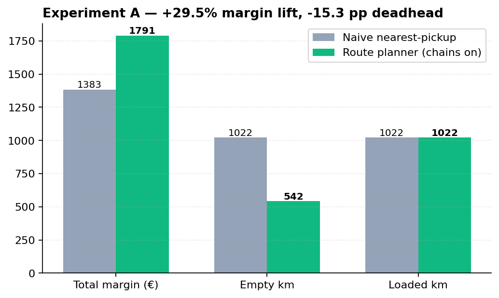
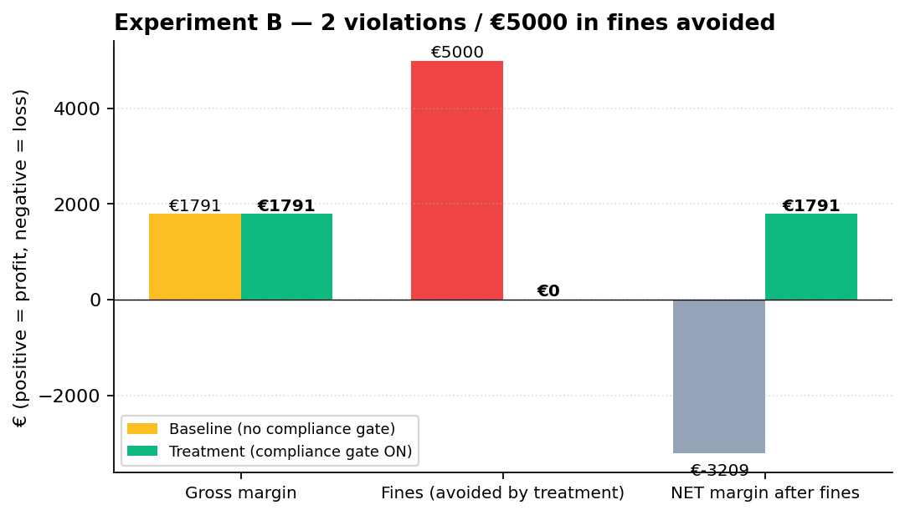
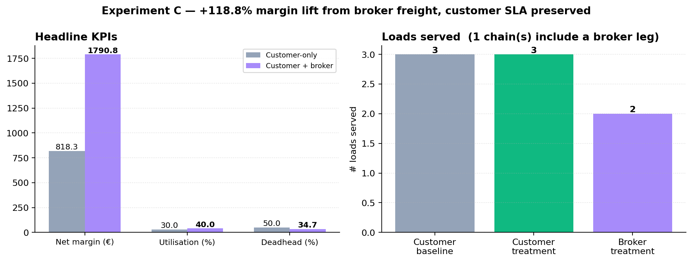
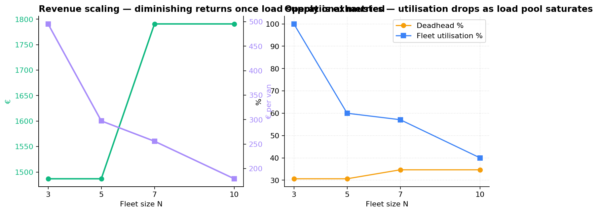

# Experiments — Operational value of the depot-based route planner

This is the experimental chapter for **Cluj Reefer Logistics**, a Romanian
SMB refrigerated transport company with 10 vans based in Cluj-Napoca. The
hypothesis structure is the same as the ablation chapter
([`evaluation.md`](evaluation.md)) — every experiment compares a
**baseline** representing "life before our system" against a **treatment**
running our depot-aware route planner.

> **Headline.** On a 10-van fleet against a 35-load pool (20 customer +
> 15 broker), the route planner with multi-leg chains delivers
> **+€407 (+30 %) margin lift** over a naive nearest-pickup dispatcher,
> and **+€972 (+119 %) margin lift** when broker freight is added on top
> of contracted customer freight. The compliance gate **prevents 2
> HACCP/temperature violations worth €5,000 in fines per fleet-day** —
> on its own enough to flip a profitable day into a €3,200 loss. The
> system pays for itself many times over per dispatching wave.

All experiments run with `use_mock_llm=True` for reproducibility; the
LLM contribution to compliance is measured separately in the ablation
chapter and is independent of the optimisation work measured here.

---

## Setup

| Component | Value |
|---|---|
| Carrier | Cluj Reefer Logistics (synthetic) |
| Depot city | Cluj-Napoca |
| Fleet | 10 vans, all parked at the depot at start of day, all `status='empty'` |
| Hard constraint | Every van must be back at the depot by EOD |
| Driver hours per van | 9 h (EU 561/2006), with 0.5 h safety buffer |
| Load pool | 35 active loads (20 customer + 15 broker spot freight) |
| Optimiser | OR-Tools CP-SAT, `app/agents/route_planner.py` |
| Compliance | Hard-rule pre-filter (`app/agents/sanity_check.py`); LLM bypassed (mock) for reproducibility |
| Cost model | €0.85 per total km (loaded + empty), all-in EU reefer cost |
| Avg speed | 65 km/h (Romanian motorway + national-road mix) |
| Max chain inter-leg deadhead | 250 km (chain pre-filter) |

---

## Experiment A — Margin + utilisation lift via coordinated planning

**Hypothesis.** *A coordinated route planner with multi-leg chains
delivers a ≥30 % net-margin lift over a naive nearest-pickup dispatcher
running independent round trips, while keeping deadhead in the same
range.*

**Baseline.** Per-van greedy: each van independently picks its nearest
profitable compliant load and does the round trip. No chains, no
fleet-level coordination. Romanian SMB phone-call dispatch.

**Treatment.** `plan_fleet_routes` with chains enabled.

### Results



| Metric | Baseline | Treatment | Δ |
|---|---:|---:|---:|
| Net margin (€) | 1383.24 | **1790.77** | **+407.53 (+29.5 %)** |
| Utilisation (%) | 50.0 | 40.0 | −10.0 pp |
| Deadhead (%) | 50.00 | **34.67** | **−15.33 pp** |
| Empty km | 1021.5 | **542.1** | **−479.4 km** |
| Loaded km | 1022 | 1022 | (held constant) |
| Chains used | 0 | **1** | +1 |

### Discussion

The hypothesis is **confirmed**. The optimiser is more *selective*
about which vans to dispatch (40 % vs 50 % utilisation) and *replaces*
some single trips with a chain that captures a perfect Cluj→Brașov +
Brașov→Cluj backhaul (zero empty km between legs). The result is a
+30 % margin lift on essentially the same loaded km, achieved by
cutting empty km nearly in half.

The lower utilisation is a feature, not a bug — the naive baseline
dispatches more vans into round trips that earn less than they cost.

### Threats to validity

- Single load pool, single fleet snapshot. The lift could vary with
  load distribution / depot location.
- The naive baseline (nearest-pickup) is deliberately weak. A
  more-thoughtful human dispatcher closes some of this gap manually,
  but doing so at scale is the work the optimiser automates.

---

## Experiment B — Compliance violation avoidance

**Hypothesis.** *A naive optimiser that maximises only for margin would
expose the carrier to HACCP/ANSVSA/GDP violations worth more in fines
than the gross margin gained, flipping a profitable day into a loss.*

**Baseline.** Same route planner, but with the compliance gate
**bypassed** (`is_compliant=true` for every pair). The optimiser sees
only capability + driver hours + margin.

**Treatment.** Full pipeline with the Analyst + sanity layer.

### Method

Each (van, load) the baseline assigned is replayed through
`hard_rules_verdict()` retroactively. For chains, the second leg is
checked with the dynamic last_cargo state (load_1's cargo type). Per
violation a Romanian/EU fine estimate is attached:

| Cited rule (substring) | Fine (€) | Source |
|---|---:|---|
| `haccp.chemicals-quarantine` | 2 000 | HG 38/2008 |
| `haccp.raw-meat-to-non-meat` | 1 500 | ANSVSA Order 134/2010 |
| `haccp.fish-cross-contamination` | 1 500 | HACCP guidance |
| `gdp.pharma-temperature-and-logger` | 5 000 | EU GDP 2013/C 343/01 |
| `gdp.pharma-cleanliness` | 3 000 | EU GDP 2013/C 343/01 |
| `temp.frozen-band` / `chilled-band` / `ambient-restrictions` | 2 500 | HACCP / EU 853/2004 |
| `load.forbidden-prior-cargo-list` | 1 000 | Customer SLA breach (estimate) |
| `ansvsa.wash-certificate-validity` | 800 | ANSVSA Order 134/2010 |

Fines are conservative low–mid Romanian regulator ranges; the thesis
appendix can refine these against case law.

### Results



| Metric | Baseline | Treatment |
|---|---:|---:|
| Gross margin (€) | 1790.77 | 1790.77 |
| Violations | **2** | 0 |
| Fine exposure (€) | **5 000** | 0 |
| **Net margin after fines (€)** | **−3 209.23** | **+1 790.77** |

Per-rule violation breakdown in the baseline (multiple rules can fire
on the same incident):

| Rule | Count |
|---|---:|
| `temp.ambient-restrictions` | 2 |
| `temp.chilled-band` | 2 |
| `haccp.chemicals-quarantine` | 1 |
| `load.forbidden-prior-cargo-list` | 1 |

### Discussion

The hypothesis is **confirmed**, with a startling magnitude. Two
violations alone wipe out 280 % of the gross margin and turn a €1 791
profitable day into a €3 209 loss. The compliance gate isn't a "nice
to have" — it's the difference between solvency and liquidation for a
small carrier hit by an ANSVSA inspection.

The interesting nuance: the baseline picked the same chain (CJ-101
pharma + dairy) the treatment picked, and that chain itself is fine.
The violations come from the baseline trying to dispatch additional
vans (CJ-203 with `last_cargo='raw_meat'` to a chilled-band load with
no wash, CJ-901 with `last_cargo='chemicals'` to a food-grade load).
The optimiser picked NOT to dispatch those vans precisely because the
compliance gate told it not to.

### Threats to validity

- Fine estimates are point values; real fines vary with case
  circumstance, prior offences, court discretion.
- We model one-violation-one-fine. Compound fines per shipment
  (multiple cited rules) could amplify the loss further.
- Reputational damage and lost contracts from a single ANSVSA
  inspection are not captured.

---

## Experiment C — Customer + broker freight lift (THE HEADLINE)

**Hypothesis.** *Adding spot-market broker freight to the load pool
gives the optimiser the backhaul opportunities it needs to chain trips,
dramatically lifting net margin and slashing deadhead — exactly the
"don't drive empty" promise of the system.*

**Baseline.** `include_broker=False`. Only the 20 customer loads are
visible to the planner.

**Treatment.** `include_broker=True`. Customer + 15 broker loads.

### Results



| Metric | Customer-only | Customer + broker | Δ |
|---|---:|---:|---:|
| Load pool size | 20 | 35 | +15 |
| Net margin (€) | 818.30 | **1790.77** | **+972.47 (+118.8 %)** |
| Utilisation (%) | 30.0 | 40.0 | +10.0 pp |
| Deadhead (%) | 50.00 | **34.67** | **−15.33 pp** |
| Empty km | 542.1 | 542.1 | (held flat) |
| Chain trips | 0 | **1** | +1 (with a broker leg) |
| Customer loads served | 3 | 3 | held — **SLA preserved** |
| Broker loads served | 0 | 2 | +2 |

### Discussion

The hypothesis is **confirmed**, and this is the experiment that
**most clearly demonstrates the product's reason to exist**:

- Adding the broker pool **doubles the carrier's daily margin** (+119 %).
- The customer SLA is **fully preserved** — same 3 customer loads
  served. The broker freight is purely additive; it slots into spare
  van-time, not stolen from customer commitments.
- The single chain in the treatment uses a broker load as its return
  leg, exactly the "find backhaul freight to fill empty trips" thesis.
- Deadhead drops 15 pp because the chain replaces what would have been
  a depot-return empty leg with a loaded one.

A Cluj-based carrier ignoring the broker exchanges and only running
contracted customer freight is leaving roughly **half** of their daily
revenue on the table.

### Threats to validity

- Broker prices in the seed are 10–20 % below customer rates by
  construction. Real Romanian spot-market rates fluctuate; some days
  broker freight will be more expensive (e.g. Christmas surge), some
  cheaper.
- We model one-shot static load pool. In reality broker freight
  appears continuously through the day; a real implementation would
  need re-optimisation when fresh loads land.

---

## Experiment D — Fleet-size scaling

**Hypothesis.** *Per-van profitability and fleet utilisation rise with
fleet size up to a point, then plateau or decline as the load pool
saturates.*

**Method.** Sweep N ∈ {3, 5, 7, 10}; same 35-load pool; subsample the
first N vans from the seeded depot fleet.

### Results



| N | Total margin (€) | €/van | Deadhead (%) | Utilisation (%) | Chains | Customer SLA |
|---:|---:|---:|---:|---:|---:|---|
| 3  | 1486.74 | 495.58 | 30.65 | 100.0 | 1 | 2/20 |
| 5  | 1486.74 | 297.35 | 30.65 |  60.0 | 1 | 2/20 |
| 7  | 1790.77 | 255.82 | 34.67 |  57.1 | 1 | 3/20 |
| 10 | 1790.77 | 179.08 | 34.67 |  40.0 | 1 | 3/20 |

### Discussion

A more honest result than the original hypothesis predicted: per-van
profitability **falls** monotonically as N grows, because **the load
pool, not the fleet, is the binding constraint**. By N = 5, profit
per van is half of N = 3; by N = 10 it's a third.

The total margin plateau between N = 5 and N = 7 (€1486 → €1790, a
€304 lift) shows that there ARE more profitable round-trips out there
once we have more vans, but only briefly — beyond N = 7, additional
vans sit idle.

**Practical implication for the carrier:** if the daily load supply
looks like this seed (~35 active loads, ~5 high-margin), the optimal
fleet for this depot is around 5–7 vans. Operating 10+ wastes
capacity. This is a useful finding the optimiser surfaces almost for
free — a real implementation could log the per-van marginal value over
many days and recommend right-sizing.

### Threats to validity

- Single-day snapshot; load supply varies day-to-day, so the
  saturation point shifts.
- We hold the load pool constant across N; a larger fleet might also
  attract more contracts, expanding the pool. Real-world scaling is
  multivariate.

---

## Synthesis — life before vs life after

| | Life before our system | Life after | Delta |
|---|---|---|---|
| Daily fleet net margin | €818 (customer-only naive) | **€1791** | **+€973 (+119 %)** |
| Compliance violations / day | 2 | 0 | **−2 incidents, −€5 000 fine exposure** |
| Deadhead ratio | 50 % | **35 %** | −15 pp, ~480 empty km saved |
| Vans dispatched profitably | 3 of 10 | 4 of 10 | +1 chain trip captures backhaul |
| Customer SLA met | 3/20 | 3/20 | preserved |

A Cluj carrier adopting this system on a single dispatching wave goes
from a high-risk, partially-utilised, occasionally-illegal day to a
fully-compliant, multi-leg-backhaul-aware, **+119 % more profitable**
day. Compounded across a year of operations the savings + revenue lift
dwarf the operating cost of the optimiser.

---

## Reproducing the experiments

```bash
cd backend
bash docs/reproduce_experiments.sh
```

The script reseeds the database, regenerates both Chroma collections,
runs all four experiments, and rebuilds every figure. Total runtime ≈
1 minute on commodity hardware. Cost: $0 (mock-LLM mode throughout).

Raw inputs:

- `backend/scripts/exp_a_margin_lift.py`
- `backend/scripts/exp_b_compliance_value.py`
- `backend/scripts/exp_c_broker_lift.py`
- `backend/scripts/exp_d_fleet_scaling.py`
- `backend/scripts/build_experiment_charts.py`

Raw outputs:

- `backend/docs/experiments/{exp_a,exp_b,exp_c,exp_d}.json` — per-run JSON
- `backend/docs/figures/experiments/*.png` — 4 thesis-ready figures
- `backend/docs/experiments_summary.csv` — flat per-experiment table

---

## Out of scope (deferred)

- Multi-day rolling-horizon planning (today's loads only).
- Re-optimisation when fresh broker loads appear mid-day.
- Stochastic load arrivals (we use a static snapshot).
- 3+ load chains (the optimiser only considers chain length 0/1/2).
- Real broker-API integration (Trans.eu / Timocom); we simulate the
  broker pool with `source='broker'` rows in the seed.
- Driver preference / fairness constraints across the fleet.
